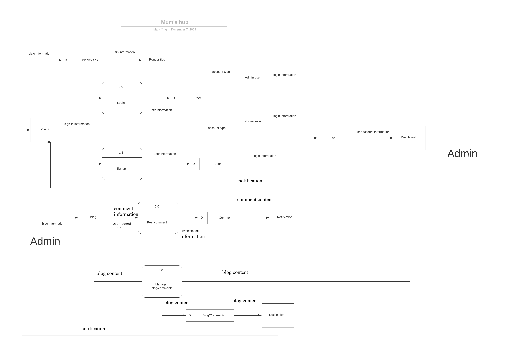
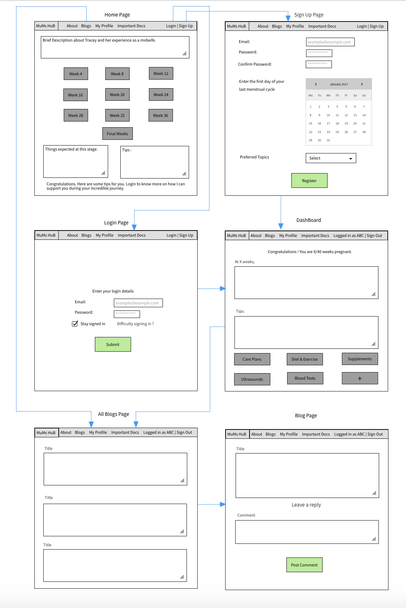
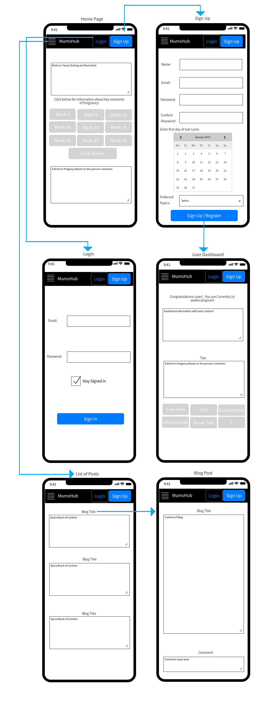
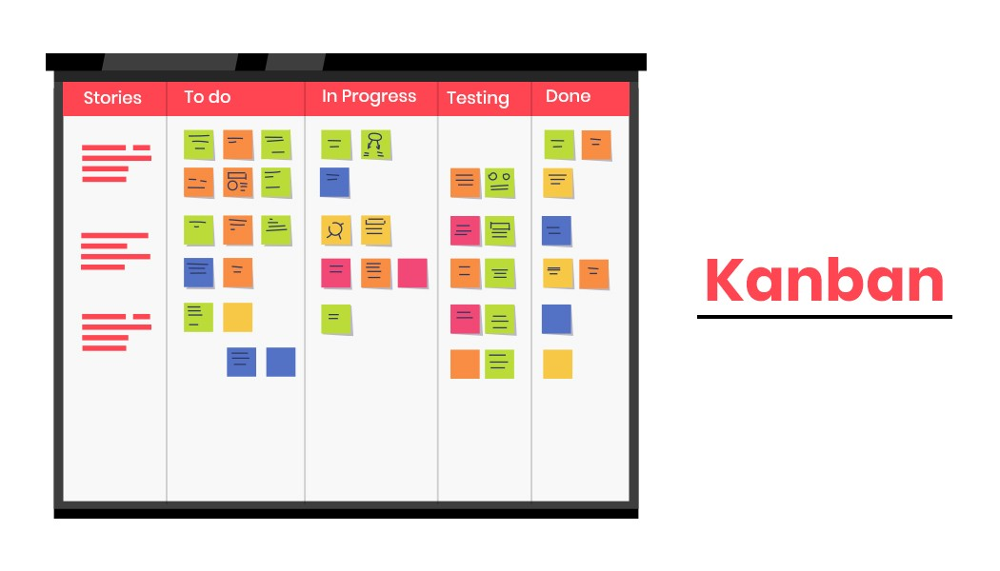
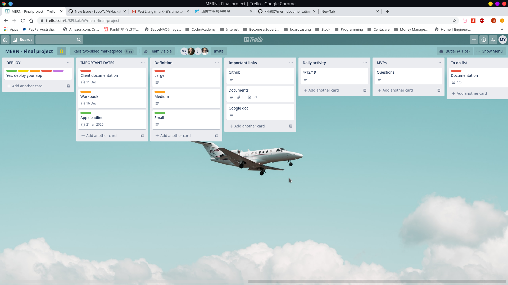
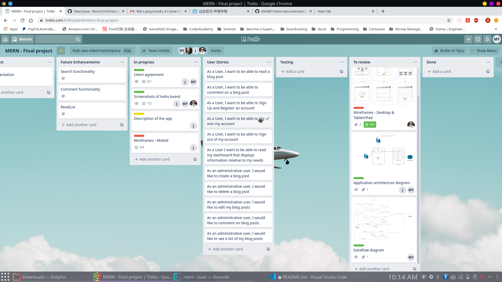
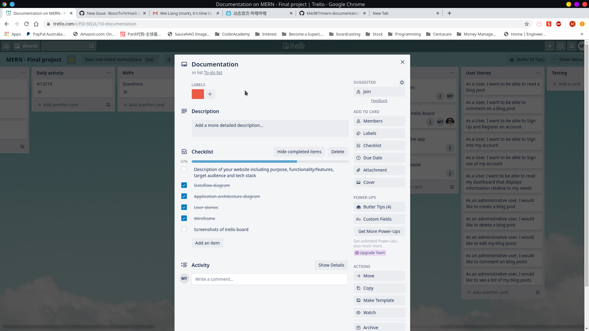

# Mums-hub
Created By Sherine Mathew, Mark Ying and Jeffrey Dorling

## Description 
### Purpose
Mums-hub is a website that is designed as an informative blog to help pregnant woman navigate through 
pregnancy. 

Pregnancy is one of the most exciting as well as daunting times in a woman's life. Optimising health and wellbeing during pregnancy is essential for the woman; her family’s and her infant’s future and ongoing health. Unfortunately for a number of women, pregnancy can be a stressful period and lead to significant physical and psychological illness. This website is developed to provide information to women with the emotional and physical support they need to endure this process. 

Blogs are created by Ms Tracey Dorling who has a massive 20+ years of experience working as a midwife. A typical pregnancy lasts 40 weeks from the first day of the last menstrual period (LMP) to the birth of the baby. It is divided into three stages, called trimesters: first trimester, second trimester, and third trimester. The fetus undergoes many changes throughout maturation. Tracey has explained what preganancy is all about in a week to week development stage. She has explained clearly what to expect in a particular week, what is normal during that week and what are the options available to better manage pregnancy. Visitors to this website can read blogs and also allows them to register as a user. Once registered, personalised posts are provided. Users can search through a variety of topics that they are interested in. They can also comment on the post and share their experience or ask a question related to the post.

### Functionality/Features
#### A Blog
- Where registered users will be able to read and comment on posts.
- Administrators will be able to Create, Edit and Delete posts.

#### A Dashboard for aspiring mothers which will track
- Due Dates 
- Weekly Tips
- Generic information about the stage of pregnancy the woman is currently going through.

#### User Authentication
- Which gives us the ability to differentiate between Administrators and Users.
- Abilities to Sign Up, Sign In and Sign Out.

### Target Audience
Mums-Hub targets women audiences in any stage of pregnancy.
It will centre around informing women of what they are going through and tips on how to make this as 
easy as possible.

### Technologies Used
This has been developed utilising the MERN technologies. The stack includes;-
- MongoDB
- Express
- React
- NodeJS

## Dataflow Diagram

## Application Architecture Diagram 

## User Stories
- As a user, I can register a new account.  
- As a user, I can sign in to my account. 
- As a user, I can accept/decline the disclaimer.
- As a logged-in user, I can sign out of my account.
- As a user, I can read a blog related to pregnancy.
- As a logged-in user, I can comment on a blog.
- As a logged-in user, I can manage my dashboard
- As a logged-in user, I can access information tailored to my needs.
- As an administrative user, I can create a blog. 
- As an administrative user, I can edit a blog. 
- As an administrative user, I can delete a blog.

## Wireframes

### Desktop

### Tablet/iPad

### Mobile

## Planning Methodology with Screenshots

Our team has decided to use the Kanban framework to implement agile software development.

We start the day with daily standup to track our progress and the tasks for the day. If anyone is blocked at any point, we would work together to resolve the problem.  

### Trello
The tool we used to manage the jobs is trello. We will be delegating job cards and following along with what cards are complete and incomplete. This was considered and agreed to during the first team meeting. It was also approved by all members with a better visualization of the job status(like to-do, in-progress etc.), difficulty, estimated time and job priority.   

### Source control process

When we move to development stage, we will use github as our main source control platform. And we are following the featture branch workflow where we will derive feature branches from master branch. After the code is complete in each feature branch, the assigned team member is then required to raise pull requests. At least one other team member also reviews the code, approves it and make appropriate merges to the master branch.

When changes are made, the assigned team member makes appropriate changes on trello cards to update the progress.
